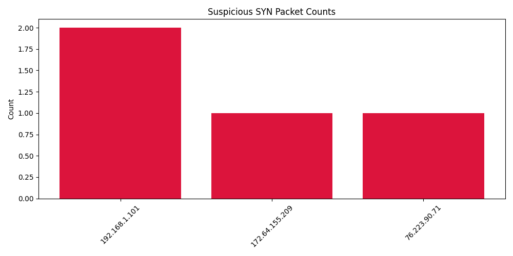

---

```markdown
# 🕵️‍♀️ NetSpy: Network Packet Analyzer with Scapy & Wireshark

NetSpy is a beginner-friendly network packet analysis project using **Scapy** and **Wireshark**. It captures live packets, filters specific types, visualizes suspicious behavior, and saves reports — all while helping you learn real-world network monitoring!

---

## 📁 Folder Structure


NetSpy/
├── captures/             # Saved .pcap capture files
├── outputs/              # Text reports generated
├── scripts/              # All Python scripts used
├── screenshots/          # Charts and visual summaries
├── README.md             # Project documentation

---

## 🧰 Tools Used

- 🐍 Python 3.x  
- 📦 Scapy (`pip install scapy`)
- 🧠 Matplotlib (`pip install matplotlib`)
- 🧪 Wireshark (GUI to visualize `.pcap` files)
---

## 📅 Learning Journey

### ✅ Day 1: Getting Started with Scapy & Sniffing

- Captured 10 live packets using:
  ```python
  from scapy.all import sniff

  def callback(pkt):
      print(pkt.summary())

  sniff(prn=callback, count=10)
````

* Learned:

  * How packets look in terminal
  * What layers (IP, TCP, etc.) are

---

### ✅ Day 2: Filters and Saving Captures

* Applied BPF filter to sniff only HTTP (port 80) traffic:

  ```python
  sniff(filter="tcp port 80", count=20)
  ```
* Saved captured packets to a `.pcap` file using:

  ```python
  wrpcap("captures/day2_http_capture.pcap", packets)
  ```
* Opened `.pcap` in Wireshark.

---

### ✅ Day 3: Advanced Layer Extraction

* Extracted and printed:

  * Source & destination IPs
  * TCP ports
* Used `.haslayer()` and direct indexing like `pkt[IP].src`

---

### ✅ Day 4: Visualizing Traffic

* Created bar charts of SYN packets using:

  ```python
  import matplotlib.pyplot as plt
  ```
* Saved visuals to `screenshots/report_syn_chart.png`

---

### ✅ Day 5: Protocol Variety Capture

* Captured a wider mix of packets: HTTP, DNS, ICMP, etc.
* Used filters:

  ```bash
  tcp or udp or icmp
  ```

---

### ✅ Day 6: DNS and Port Scan Detection

* Detected:

  * SYN floods (possible port scan)
  * Top 10 DNS queries
* Saved findings to `outputs/suspicious_report.txt`

---

### ✅ Day 7: Custom .pcap Testing

* Downloaded sample `.pcap` files from:

  * [https://wiki.wireshark.org/SampleCaptures](https://wiki.wireshark.org/SampleCaptures)
* Used them as input to test analyzer scripts.

---

### ✅ Day 8: Combined Analysis Script

```python
from scapy.all import rdpcap, TCP, IP, DNSQR
from collections import defaultdict
import matplotlib.pyplot as plt
```

* Final report saved to:

  * `outputs/final_report.txt`
  * `screenshots/report_syn_chart.png`

---

### ✅ Day 9: Project Cleanup

* All scripts moved to `scripts/`
* Reorganized folders and tested paths
* Verified `.pcap` loading and saving works on Windows

---

### ✅ Day 10: Final Upload & GitHub

* Committed all files with:

  ```
  git add .
  git commit -m "Completed NetSpy: Full network analyzer with Scapy and Wireshark"
  git push origin main
  ```

---

## 🚀 How to Run the Project

1. Clone this repo:

   ```bash
   git clone https://github.com/<your-username>/NetSpy.git
   ```

2. Navigate inside:

   ```bash
   cd NetSpy/scripts
   ```

3. Run a script:

   ```bash
   python analyze_and_report.py
   ```

4. Open `.pcap` files in Wireshark:

   ```bash
   wireshark ../captures/testcapture.pcap
   ```

---

## 📊 Sample Output (Screenshot)



---

## ✍️ Author

Made with ❤️ by **Suzain** as a 10-day Scapy + Wireshark beginner project.

### 💡 What I Learned
- Scapy packet crafting & sniffing
- TCP & DNS packet inspection
- Reading and analyzing `.pcap` files
- Visualizing results with matplotlib
- Writing structured project documentation

---

## 🚀 Future Improvements

- 🔔 Real-time alerts on suspicious traffic
- 🌐 Web-based dashboard (Flask + Scapy)
- 📧 Email notifications on port scans
- ➕ Extend protocol support (ICMP, HTTP, etc.)

---

## 🙏 Special Thanks

To the **Scapy** and **Wireshark** communities for creating such powerful, open, and beginner-friendly tools.

---

## 📄 License

This project is licensed under the MIT License — feel free to **fork**, **learn**, and **build** on it!
